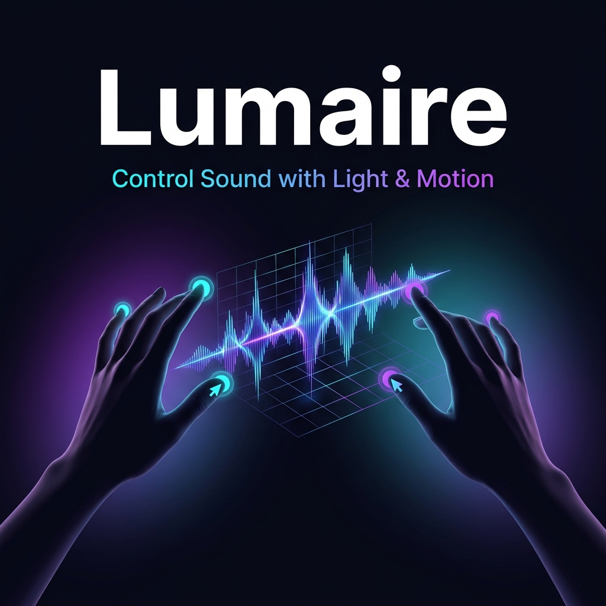

<div align="center">



# 🎛️ Lumaire

### *Control Sound with Light & Motion*

**A gesture-driven, browser-native DJ controller powered by computer vision**

[](https://vite.dev)
[](https://mediapipe.dev)
[](https://tonejs.github.io)
[](https://threejs.org)
[](https://typescriptlang.org)
[](LICENSE)

</div>

---

## 📖 Table of Contents

- [About the Project](#about-the-project)
- [Demo](#demo)
- [Video Demo](#-video-demo)
- [Features](#features)
- [Architecture](#architecture)
- [Tech Stack](#tech-stack)
- [Getting Started](#getting-started)
  - [Prerequisites](#prerequisites)
  - [Installation](#installation)
  - [Running Locally](#running-locally)
- [How It Works](#how-it-works)
  - [Gesture Reference](#gesture-reference)
  - [Keyboard Fallbacks](#keyboard-fallbacks)
- [Project Structure](#project-structure)
- [Roadmap](#roadmap)
- [Contributing](#contributing)
- [Team](#team)
- [License](#license)

---

## 🎯 About the Project

**Lumaire** is a touchless, webcam-powered DJ controller built entirely in the browser. Using your hands as the interface, you can play, pause, crossfade, and apply EQ effects to two audio tracks — no physical hardware required.

The project was built as part of the **DT2140** course at KTH Royal Institute of Technology, exploring novel Human-Computer Interaction (HCI) paradigms through gesture-based musical expression.

> *"What if your body was the instrument?"*

Lumaire answers that question by transforming real-time hand tracking data into expressive, low-latency audio control — all inside a single browser tab.

---

## 🎬 Demo

> **Live demo coming soon!**

To try it yourself right now, clone the repo and follow the [Getting Started](#getting-started) guide below. All you need is a webcam.

---

## 📹 Video Demo

> Click the thumbnail below to watch the intro video on YouTube:

<div align="center">

[](https://www.youtube.com/watch?v=3lUEl5AKHR8)

*👆 Click to watch — see Lumaire in action with live gesture control*

</div>


---

## ✨ Features

| Feature | Description |
|--------|-------------|
| 🖐️ **Real-time Hand Tracking** | Detects both hands simultaneously using MediaPipe Hands at 30+ FPS |
| 🎶 **Dual-track Playback** | Load two audio tracks (A & B) and control them independently |
| 🎚️ **Gesture Crossfader** | Move your left hand left/right to blend between tracks in real time |
| 🔊 **Master Volume Control** | Raise/lower your right hand to adjust the master output level |
| 🥁 **Bass & Treble EQ** | Fist gestures apply real-time EQ curves to the audio signal |
| 🎤 **Clap Gesture** | Trigger special actions with a hands-together clap |
| ⌨️ **Keyboard Fallbacks** | Full keyboard control mapping for accessibility and testing |
| 🌐 **No Install Needed** | Runs entirely in-browser — zero plugins, zero downloads |

---

## 🏗️ Architecture

Lumaire is built around four decoupled, event-driven engines that communicate through a shared reactive state store:

```
┌──────────────────────────────────────────────────────────┐
│                      MediaPipe Hands                     │
│              (webcam → 21 landmarks per hand)            │
└─────────────────────────┬────────────────────────────────┘
                          │
                          ▼
┌─────────────────────────────────────────────────────────┐
│                   🤚 Gesture Engine                      │
│  • Pinch detection    • Fist / Open hand                │
│  • Position tracking  • Clap detection                  │
│  • Smoothing, debouncing, low-pass filters              │
└─────────────────────────┬───────────────────────────────┘
                          │  writes
                          ▼
┌─────────────────────────────────────────────────────────┐
│                   🗄️  State Store                        │
│  masterVolume · crossfaderPosition · bass · treble      │
│  trackAPlaying · trackBPlaying · mode · lastClapTs      │
└──────┬──────────────────────────────────┬───────────────┘
       │  reads                           │  reads
       ▼                                  ▼
┌──────────────────┐            ┌───────────────────────┐
│  🔊 Audio Engine  │            │  🎨 Visual Engine      │
│  Tone.js         │            │  Three.js / Canvas 2D │
│  • Dual buffers  │            │  • Hand cursors        │
│  • EQ filters    │            │  • 3D beat grid        │
│  • Crossfader    │            │  • HUD overlays        │
│  • Transport     │            │  • Debug panel         │
└──────────────────┘            └───────────────────────┘
```

**Key Design Principle:** Audio timing is completely decoupled from the rendering frame rate. The audio engine uses Tone.js's Web Audio scheduler to ensure sample-accurate playback regardless of GPU load or animation frame drops.

---

## 🛠️ Tech Stack

| Layer | Technology | Purpose |
|-------|-----------|---------|
| **Build** | [Vite 7](https://vite.dev) + TypeScript | Fast dev server, ESM bundling |
| **Hand Tracking** | [@mediapipe/hands](https://mediapipe.dev) | 21-point 3D landmark detection |
| **Audio** | [Tone.js 15](https://tonejs.github.io) | Web Audio scheduling, EQ, transport |
| **3D Visuals** | [Three.js 0.181](https://threejs.org) | 3D beat grid, hand cursors |
| **Camera** | [@mediapipe/camera_utils](https://mediapipe.dev) | Webcam capture pipeline |
| **Language** | JavaScript (ES Modules) | Application logic |

---

## 🚀 Getting Started

### Prerequisites

Before you begin, make sure you have the following installed:

- **Node.js** ≥ 18.0 — [Download](https://nodejs.org)
- **npm** ≥ 9.0 (included with Node.js)
- A browser with **WebRTC support** (Chrome or Edge recommended)
- A **webcam** for gesture control (optional — keyboard fallbacks available)

### Installation

1. **Clone the repository:**

```bash
git clone https://github.com/sehgalbhavya/DT2140-Project.git
cd DT2140-Project
```

2. **Install dependencies:**

```bash
npm install
```

### Running Locally

Start the development server:

```bash
npm run dev
```

Then open your browser and navigate to:

```
http://localhost:5173
```

> ⚠️ **Webcam Permission Required:** The browser will ask for camera access when the page loads. This is needed for hand tracking. Grant access and position yourself so both hands are visible.

**Build for production:**

```bash
npm run build
```

**Preview the production build:**

```bash
npm run preview
```

---

## 🤚 How It Works

### Gesture Reference

The system detects both hands simultaneously and maps gestures to audio controls:

#### Right Hand 🖐️ (Track B + Volume)

| Gesture | Action |
|---------|--------|
| ✌️ Pinch | Toggle Track B play / pause |
| 🤙 Pinch + Move ↑↓ | Adjust Master Volume |
| ✊ Fist + Move ↑↓ | Adjust Bass EQ |

#### Left Hand 🖐️ (Track A + Crossfader)

| Gesture | Action |
|---------|--------|
| ✌️ Pinch | Toggle Track A play / pause |
| 🤙 Pinch + Move ←→ | Move Crossfader (blend A ↔ B) |
| ✊ Fist + Move ↑↓ | Adjust Treble EQ |

#### Both Hands 👐

| Gesture | Action |
|---------|--------|
| 👏 Clap (hands together) | Trigger action / Beat alignment |

#### Modes

The system operates in three mutually exclusive modes, preventing accidental input:

- **Edit Mode** — Default, gesture-based mixing
- **Tempo Mode** — Two-hand distance controls BPM
- **Effects Mode** — Two-hand rotation controls effect parameters

### Keyboard Fallbacks

Full keyboard control is available for accessibility and testing (no webcam needed):

| Key | Action |
|-----|--------|
| `P` | Toggle all tracks (play / pause) |
| `A` + `Space` | Toggle Track A |
| `B` + `Space` | Toggle Track B |
| `↑` / `↓` | Master Volume up / down |
| `←` / `→` | Crossfader left / right |
| `T` + `↑` / `↓` | Treble up / down |
| `B` + `↑` / `↓` | Bass up / down |
| `C` | Trigger Clap action |

You can also **click directly on the status displays** (Master, Crossfader, Bass, Treble) to adjust values with the mouse.

---

## 📁 Project Structure

```
DT2140-Project/
├── public/
│   └── banner.png          # Project banner image
├── src/
│   ├── main.js             # App entry point, event wiring, keyboard controls
│   ├── gestureEngine.js    # MediaPipe landmark → gesture classification
│   ├── audioEngine.js      # Tone.js dual-track playback, EQ, crossfader
│   ├── visualEngine.js     # Three.js / Canvas 2D rendering, HUD
│   ├── stateStore.js       # Reactive state store (subscribe/getState/setState)
│   └── style.css           # UI styling & layout
├── index.html              # App shell with DJ control panel
├── package.json
├── tsconfig.json
├── context.md              # Detailed system design spec
└── project-plan.md         # 4-week development timeline
```

---

## 🗺️ Roadmap

### Weeks 1–2
- [x] MediaPipe Hands integration
- [x] Pinch, fist, and open-hand gesture detection
- [x] Left-hand vertical row selection
- [x] Gesture Engine, State Store, Audio Engine, Visual Engine architecture
- [x] 2D beat grid UI
- [x] Dual-track audio loading and playback
- [x] Crossfader, master volume, bass, treble controls
- [x] Keyboard fallback controls

### Week 3
- [x] Three.js 3D beat grid
- [x] 3D hand cursors mapped to world space
- [x] Two-hand distance → real-time tempo control
- [x] Two-hand rotation → filter sweep (Effects Mode)

### Week 4
- [x] Gesture smoothing & jitter reduction polish
- [x] Mode indicator animations
- [x] HCI user evaluation & usability testing
- [x] Demo video and presentation slides

---

## 🤝 Contributing

Contributions, issues and feature requests are welcome!

1. **Fork** the repository
2. **Create** your feature branch: `git checkout -b feature/amazing-feature`
3. **Commit** your changes: `git commit -m 'feat: add amazing feature'`
4. **Push** to the branch: `git push origin feature/amazing-feature`
5. **Open** a Pull Request

Please follow the existing code style and describe your changes clearly in the PR description.

---

<!--
## 👥 Team

This project was developed as part of **DT2140 – Multimodal Interaction and Interfaces** at **KTH Royal Institute of Technology**.

| Member | Role |
|--------|------|
| **A** | Gesture Recognition Lead |
| **B** | Audio & Sequencer Lead |
| **C** | Three.js Visual Lead |
| **D** | Integration, UX & Evaluation |
-->

---

## 📄 License

This project is licensed under the **MIT License** — see the [LICENSE](LICENSE) file for details.

---

<div align="center">

Made with ❤️ at KTH Royal Institute of Technology

*DT2140 – Multimodal Interaction and Interfaces*

</div>
